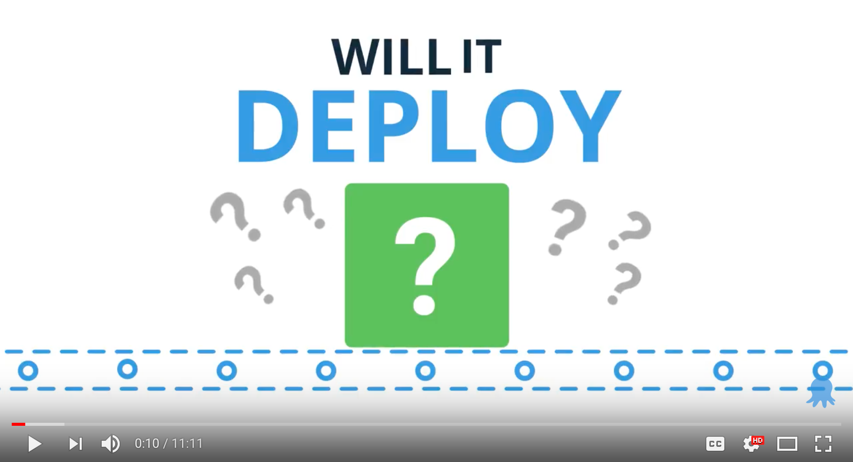
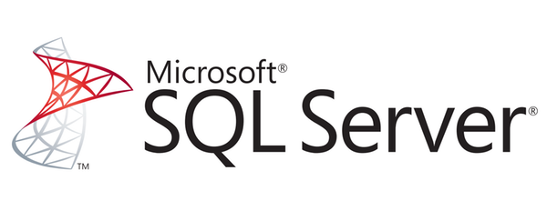
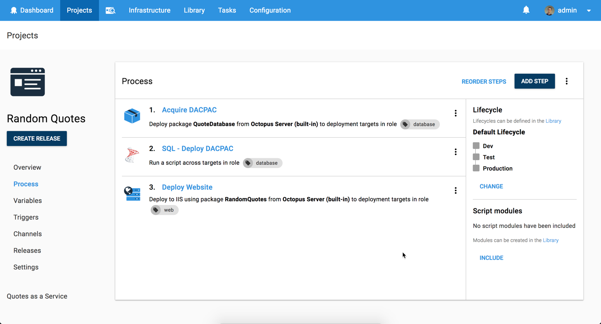
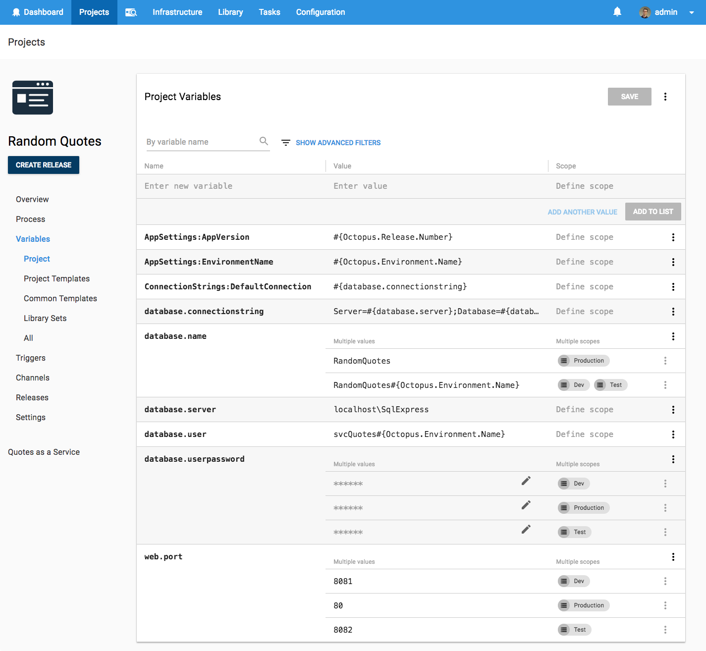

# Deploying to SQL Server with a DACPAC - Will it Deploy? Episode 4

Will it deploy is a video series where we try to automate the deployment of different technologies with Octopus Deploy. In Episode 4, we explore how to automate the deployment of a Microsoft SQL Server database using a DACPAC (Data-tier application Package) to an Amazon Web Services (AWS) virtual machine (VM).

## Problem

### Tech Stack

Our app is a quote generator called [Random Quotes](https://github.com/OctopusSamples/WillItDeploy-Episode004). The application is pretty simple but it allows us to illustrate how to deploy database changes and updates.

* Microsoft [ASP.NET Core 2.0](https://docs.microsoft.com/en-us/aspnet/core/) web app
* [Data-tier application Package (DACPAC)](https://docs.microsoft.com/en-us/ef/core/) framework
* Microsoft [SQL Server 2017](https://www.microsoft.com/en-au/sql-server/) database

Kudos to our marketing manager [Andrew](https://twitter.com/andrewmaherbne) who has been learning to code and built the first cut of this app. Great work! 

### Deployment Target

* AWS - [EC2](https://aws.amazon.com/ec2) virtual machine 
* Microsoft [Windows Server 2016](https://www.microsoft.com/en-au/cloud-platform/windows-server)

## Solution

So will it deploy? **Yes it will!** Our deployment process looks like the following.

Then we add the following steps to successfully deploy our app including cloud infrastructure provisioning and a zero downtime production deployment.

- Octopus **Deploy a Package** step to copy our database scripts to our database deployment target
- Octopus Community Contributed step template -  **[SQL - Deploy DACPAC](https://library.octopusdeploy.com/step-templates/58399364-4367-41d5-ad35-c2c6a8258536/actiontemplate-sql-deploy-dacpac)** to deploy our DACPAC to our SQL Server database. 
- Octopus **Deploy to IIS** step to deploy our ASP.NET Core web application

This project uses the following variables to store our app settings, database connection details and web app configuration.

This episode's [GitHub repo](https://github.com/OctopusSamples/WillItDeploy-Episode004) contains all the resources and links used in this video.

### Wrap-up

We hope you enjoyed this episode as we have many more in the works! If there's a framework or technology you'd like us to explore, let us know in the comments.

Don't forget to subscribe to our [YouTube](https://youtube.com/octopusdeploy) channel as we're adding new videos regularly. Happy deployments! :)
